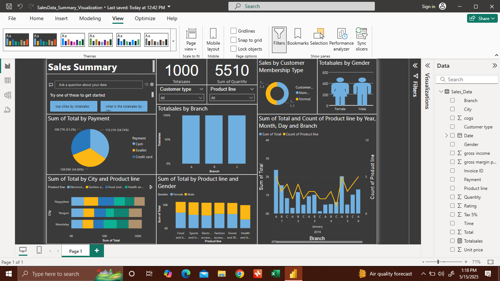

# sales-dashboard-powerbi
# 📊 Sales Dashboard - Power BI Project

This repository contains an **interactive sales dashboard** built using **Power BI**, designed to visualize key business insights from a fictional retail dataset.

---

## ✨ Features

- 📈 **Sales Summary** with Total Sales & Quantity
- 👤 Sales breakdown by **Customer Type & Gender**
- 💳 Sales analysis by **Payment Method**
- 🌍 Total sales by **City and Branch**
- 🕒 Trends by **Month, Day, and Branch**
- 📦 Insights by **Product Line and Gender**

---

## 📂 Files Included

- `SalesData_Summary_Visualization.pbix` – Main Power BI dashboard file *(read-only on GitHub)*
- `1000053647.png` – Screenshot preview of the dashboard

---

## 🔒 How to View This Dashboard

1. **Download** the `.pbix` file by clicking on it, then clicking **"Download"**
2. Open it using **[Power BI Desktop](https://powerbi.microsoft.com/en-us/desktop/)**
3. Explore filters, slicers, and visuals interactively

⚠️ **Note:** File is shared in read-only mode; no online editing available on GitHub

---

## 📌 About This Project

This dashboard was created as part of my data analytics learning journey to practice skills in:
- Data Cleaning and Modeling
- DAX Calculations
- Report Design and Visual Storytelling

---

## 👋 Connect with Me

**LM Mohammed Akil**  
Aspiring Data Analyst | Power BI & Excel Enthusiast  
[LinkedIn](https://linkedin.com) (add your link) • [GitHub](https://github.com) (add your link)

---

⭐ If you like this project, give it a **star** and feel free to explore more in my GitHub profile!
